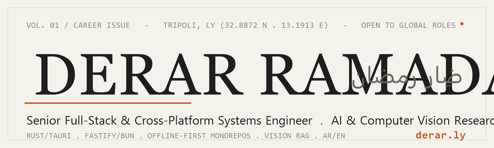

<div align="center">

  <!-- Editorial Topbar Strip (inside banner artwork) -->
  <picture>
    <source media="(prefers-color-scheme: dark)" srcset="./assets/banner-dark.png" />
    
  </picture>

  <p><b>Senior Full-Stack & Cross-Platform Systems Engineer &nbsp;·&nbsp; AI & Computer Vision Researcher</b></p>
  <p><i>Head of Programming Department @ Ministry of Agriculture &nbsp;·&nbsp; Lead Architect @ Asas Al-Mateen Technology &amp; IT (الأساس المتين)</i></p>

  <!-- Interactive Badges with Portfolio Palette (#C85A32, #1E1E1E, #6B655C) -->
  <p>
    <a href="https://derar.ly"></a>
    <a href="mailto:dev@derar.ly"></a>
    <a href="https://github.com/DerarRamadan"></a>
    <a href="https://github.com/DerarRamadan"></a>
  </p>

</div>

---

### 🏛️ Executive Statement & Engineering Philosophy

> *"Where I work, the connection drops — so the software can't. Ministries, clinics, and supply chains must keep running on ultra-fast local binaries in Arabic and English, cloud or no cloud."*

Senior Software Engineer with **4 years of technical leadership**, currently heading software development at **Libya's Ministry of Agriculture** and Lead Architect at **Asas Al-Mateen for Technology & IT** (الأساس المتين للتقنية وتكنولوجيا المعلومات). Specializing in **offline-first monorepos**, zero-cloud desktop shells (**Rust / Tauri v2**), high-throughput **Fastify / Bun** services, and hardware-level IoT bridges.

Active **M.Sc. AI Researcher** at the *Libyan Academy for Postgraduate Studies* (**Ranked 1st in Entrance Exams**), investigating **Vision-First RAG**, **GFC-R Visual Feedback**, and **Optical Context Compression** (achieving 90–95% token savings while preserving document geometry).

```
   [ Client Layer ]          React 19 / Vue 3 / Tauri v2 / Flutter (Bilingual AR/EN + RTL)
          │
          ▼  (Tokio UDP Discovery :5757 · WebSocket Event Bus · Zod v4 Contracts)
   [ Local-First Core ]      Fastify 5 / Bun Engine (Route → Service → Repository Pattern)
          │
          ▼  (Dual-Dialect Drizzle ORM Engine · WAL Snapshots · Hardware Bridges)
   [ Persistence & IoT ]     SQLite ⇄ PostgreSQL · ESC/POS Arabic Rasterizer · ZKTeco ADMS
```

---

### 📊 Key Engineering Velocity & Metrics

<div align="center">
<table>
  <tr>
    <td align="center" width="25%"><b>15+</b><br/><sub>Production Platforms Shipped</sub></td>
    <td align="center" width="25%"><b>16 Packages / 7 Apps</b><br/><sub>Unified in 1 Polyglot Monorepo</sub></td>
    <td align="center" width="25%"><b>95%</b><br/><sub>Token Reduction (Vision RAG)</sub></td>
    <td align="center" width="25%"><b>&lt; 50MB</b><br/><sub>Zero-Cloud Rust/Tauri Binaries</sub></td>
  </tr>
</table>
</div>

---

### 📦 Flagship Enterprise Monorepos

#### 1. 🏥 Asas Enterprise Suite (`@asas/*` — 16 Packages)
> **Medical ERP, Biometric Attendance, Vault Management & Remittance Core**
> *Flagship product line of **Asas Al-Mateen for Technology & IT** — الأساس المتين للتقنية وتكنولوجيا المعلومات*

[](https://github.com/DerarRamadan/asas-suite-showcase)
[](https://github.com/DerarRamadan/asas-store-final)
[](https://github.com/DerarRamadan/sink-medical-services)

* **Polyglot Desktop Core**: Powered by **Rust & Tauri v2** with WMI hardware fingerprinting, AES-256-GCM licensing, and zero-config Tokio UDP LAN auto-discovery (`:5757`).
* **Ultra-Low Latency Backend**: High-throughput **Fastify 5 / Bun** application server with 3-tier architecture (Route → Service → Repository) and dual-dialect Drizzle ORM (`Better-SQLite3 WAL` ⇄ `PostgreSQL`).
* **Native Hardware Drivers**: Custom ESC/POS thermal printing engine featuring Arabic 1-bit glyph shaper & rasterizer, cash drawer triggers, and live ZKTeco ADMS biometric punch ingestion.
* **7 Vertical Products**: *Sink Medical Services (EHR/EMR)*, *Fingerprint Manager (HR)*, *Remittance Manager (Forex & Vault)*, *Access Guard (Security)*, *Asas Warehouse (Supply Chain)*, *Oil Shop Manager (POS)*, and *Asas Database Server (GUI)*.

#### 2. 🏖️ Zwara (زوارة) Hospitality & Escrow Platform
> **Full-Stack Vacation Rental Marketplace & Double-Entry Financial Treasury**

[](https://github.com/DerarRamadan/zwara-platform-showcase)
[](https://derar.ly)

* **Monorepo Architecture**: React 19 SPA + Fastify 5.8 backend orchestrated with **Turborepo & Bun**.
* **Financial Integrity**: Immutable double-entry wallet ledger (`credit`, `reserve`, `debit`, `release`) with ACID date-overlap locking inside transactions to prevent double-booking.
* **Real-Time Event Engine**: Bi-directional polymorphic WebSocket bus (`WsEventFactory`) paired with Firebase Cloud Messaging (FCM) push notifications when clients are offline.
* **Tri-Portal Surface**: Isolated guest discovery, owner calendar/payout, and super-admin verification dashboards.

---

### 🛠️ Core Capabilities Matrix

<table>
  <thead>
    <tr>
      <th width="33%">⚡ Backend & Systems</th>
      <th width="33%">🎨 Frontend & Surfaces</th>
      <th width="33%">🔬 AI, Hardware & IoT</th>
    </tr>
  </thead>
  <tbody>
    <tr>
      <td valign="top">
        <ul>
          <li><b>Fastify 5 / Bun / Node.js</b></li>
          <li><b>Rust</b> (Tauri v2, Tokio UDP, WMI)</li>
          <li><b>Drizzle ORM</b> (Dual SQLite & Postgres)</li>
          <li><b>Turborepo</b> & Clean Monorepo Architecture</li>
          <li><b>Zod v4</b> end-to-end contract validation</li>
          <li>Double-Entry Financial Ledgers & ACID locks</li>
          <li>OAuth2 (Google, Apple) + Jose JWT sessions</li>
        </ul>
      </td>
      <td valign="top">
        <ul>
          <li><b>React 19 / Vite / Next.js</b></li>
          <li><b>Vue 3 / Nuxt 4</b></li>
          <li><b>Tailwind CSS v4 / Radix UI / shadcn</b></li>
          <li><b>Full RTL / LTR Parity</b> (Arabic/English)</li>
          <li><b>Zustand</b> (Client UI) + <b>TanStack Query</b> (Server)</li>
          <li><b>Flutter & Native Android</b> (Kotlin)</li>
          <li><b>Capacitor 7</b> & PWA Service Workers</li>
        </ul>
      </td>
      <td valign="top">
        <ul>
          <li><b>Vision-First RAG</b> & DeepSeek-OCR</li>
          <li><b>Optical Context Compression</b> (PyTorch/S-BERT)</li>
          <li><b>ESC/POS Thermal Printing</b> (Arabic glyph shaping)</li>
          <li><b>ZKTeco ADMS & ADMS-VL</b> biometric push</li>
          <li><b>Ollama & ChromaDB</b> local LLM pipelines</li>
          <li><b>WebGL Telemetry</b> & 60 FPS vector mapping</li>
          <li><b>Docker & Coolify</b> zero-touch deployments</li>
        </ul>
      </td>
    </tr>
  </tbody>
</table>

---

### 🌐 Field Deployments & Live Portals

| Project | Domain / Specialization | Stack | Live Reference |
|:---|:---|:---|:---:|
| **Almadar Gealdhabya** | Enterprise Supply Chain & B2B E-Commerce | Next.js · React · Tailwind · Node.js · PostgreSQL | [almadargealdhabya.ly ↗](https://almadargealdhabya.ly/) |
| **Muhaka Virtual Testing** | WebGL Engineering Simulation & Risk Analysis | React · Vue.js · WebGL · Fastify · Docker | [muhaka.ly ↗](https://muhaka.ly/) |
| **CADR Clinical Manager** | Clinical Workflow & Real-Time Sync | React · Vite · Tailwind · Zustand · Netlify | [cadr1.netlify.app ↗](https://cadr1.netlify.app/) |
| **Sunny Retail Storefront** | Headless E-Commerce & Optimistic Checkout | Next.js · React · Tailwind · Stripe API | [sunny-store.netlify.app ↗](https://sunny-fenglisu-f9badf.netlify.app/) |
| **First Goal Analytics** | Real-Time Sports Analytics & Timelines | Vue 3 · Nuxt · Firebase · Edge Caching | [firstgoal-ly.netlify.app ↗](https://firstgoal-ly.netlify.app/) |
| **Coastal Trails** | Offline-First Geospatial Mapping PWA | React · Leaflet · Mapbox GL · Service Worker | [coastaltrails.netlify.app ↗](https://coastaltrails.netlify.app/) |

---

### 📈 GitHub Statistics & Engineering Activity

<div align="center">
  
  &nbsp;
  
</div>

<div align="center">
  <br/>
  
</div>

---

### 🐍 Contribution Graph Art

<picture>
  <source media="(prefers-color-scheme: dark)" srcset="https://raw.githubusercontent.com/DerarRamadan/DerarRamadan/output/snake-dark.svg" />
  <source media="(prefers-color-scheme: light)" srcset="https://raw.githubusercontent.com/DerarRamadan/DerarRamadan/output/snake.svg" />
  
</picture>

<sub><i>Auto-generated every 24h from the contribution grid via <a href="https://github.com/Platane/snk">Platane/snk</a>.</i></sub>

---

### 📬 Connect & Collaborate

<div align="center">

```
📍 Location: Tripoli, Libya · Remote Worldwide
🌐 Website: https://derar.ly
✉️ Email: dev@derar.ly
💬 Languages: Arabic (Native) · English (Professional Full Working Proficiency)
```

**Direct routing** — every inbox on `derar.ly` has a job:

| Address | Reach me here for |
|:---|:---|
| [`dev@derar.ly`](mailto:dev@derar.ly) | Code reviews, issues, pull requests, technical collaboration |
| [`research@derar.ly`](mailto:research@derar.ly) | Papers, Vision-First RAG, arXiv & academic correspondence |
| [`contact@derar.ly`](mailto:contact@derar.ly) | Formal inquiries, contracts, professional correspondence |

[](https://derar.ly)
[](mailto:dev@derar.ly)
[](https://github.com/DerarRamadan)

<br/>

<sub><i>© 2026 Derar Ramadan. Crafted with precision, architectural rigor, and bilingual care.</i></sub>

</div>
